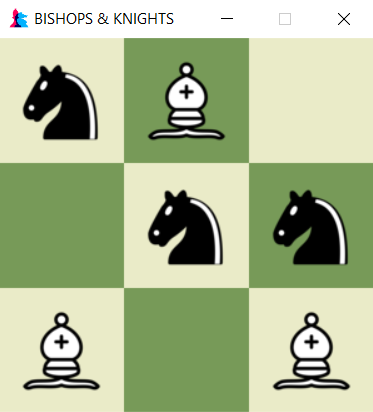
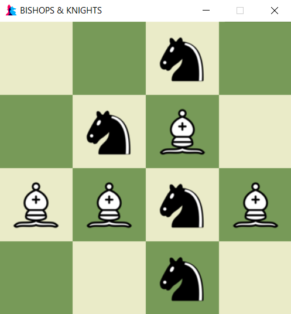

# Bishops-and-Knights
An ***extended*** version of ***Tic-Tac-Toe*** game introduces new tactical elements by allowing piece movement after the initial placement of pieces and some more added game rules that make the gameplay experience more complex and strategic.

**What is Tic-Tac-Toe ?**
> A classic paper-and-pencil game that is often played on a 3x3 grid. Players take turns marking an empty cell with either an "X" or an "O," to get three of their marks in a row horizontally, vertically, or diagonally.

### Game Setup:
- The game is played on an `n x n` grid, where **n** is the number of rows and columns and `n >= 3`
- Each player has a set of two different pieces such as ***Bishop*** which represents a **dot(`O`)**  and ***Knight*** which represents a **cross(`X`)**, with a **maximum of n** pieces for each player.

### Game Play:
- same as the rules of **Tic-Tac-Toe**
- The game starts with an empty `3 x 3` board.
- Players take turns placing their pieces on the board, one at a time. Here by convention **Bishop** will play first turn.
- If a player manages to create a ***winning line (horizontally, vertically, or diagonally)*** during the initial piece placement phase, that player wins the game.

### Extended Gameplay:
- If both players have placed their maximum number of pieces and the game has not ended, the game proceeds to an extended phase.
- The player who has the next turn can choose to move one of their pieces to an adjacent empty square, either vertically or horizontally or diagonally.
- The objective is to create a straight line of your own pieces (***Bishops*** or ***Knights***), either horizontally or vertically, to win the game.
- The game continues until one player successfully creates a winning line in the extended phase.

### Strategy and Considerations:
- Players will need to consider both initial placement and subsequent movement of pieces to create winning lines.
- Strategic thinking will be required to block opponent's potential winning lines and to set up one's own winning opportunities.
- Players can anticipate potential moves and counter moves to gain an advantage.


## Language, Tools  , and Frameworks 
>**Programming Language :** Python (Version: 3.11.4) 
<br> **Development  and Testing Tool :** Visual Studio Code
<br> **Special Library or Framework:** pygame

## Main Features of this Designed Game:
- Play this game against a friend locally on a single machine with Interactive graphical interface.
- Turn-based gameplay with visual indications for player turns
- ***Complete game sounds*** from start to end of play which also can be muted.
- **Planned extension:** *AI opponent for single-player gameplay. i.e., `AI Knight` (coming soon!)*

## Controls
- Keyboard inputs for game controls:
  - Press `Q` to Quit the game
  - Press `R` to reset the game
  - Press `M` to mute and unmute the game sounds
  - Press `I` or `UP_KEY` to increase the game board dimesion and reset the game
  - Press `D` or `DOWN_KEY` to decrease the game board dimesion and reset the game
- Mouse inputs for game controls:
  - Click on empty squares for initial placement of pieces when your turn to play.
  - Click on your piece, and then click on an adjacent empty square to move your piece when your turn to play.

## Future Plans
- Implement `AI Knight` opponent for single-player gameplay to enable playing against the computer.
- Enhance the user interface with **additional themes and customization** options.
- Add additional game modes or variants, such as timed matches or some puzzles.
- Improve the overall user experience based on feedback and suggestions.

## Do you want to play without looking at the source codes?
- You can download the executable file(`Bishops&Knights.exe`) with game images, and sounds as a zipped file(`Bishops&Knights.zip`) <a href=""> here.</a>
- Extract the zipped file and run the executable file(`Bishops&Knights.exe`) to play the game.

## How to Run if you are not a windows user?
1. Make sure you have Python 3.x installed on your system.
2. Clone this repository to your local machine or download the source code as a ZIP file.
3. Install the necessary dependencies using pip if not installed 
   ```bash
   pip install -r requirements.txt
4. Open a terminal or command prompt and navigate to the project's directory.
5. Run the game using the following command:
   ```bash
   python ./src/main.py
6. The game window will open, and you can start playing **Bishops and Knights** with a friend!

## Contributions
Contributions to this project are welcome! If you have any bug reports, feature requests, or improvements, please open an issue or submit a pull request.

## License
This project is licensed under the MIT License.
Feel free to use, modify, and distribute this code for personal and educational purposes.

## Look at these Some Gameplay Screenshots
| **Start and reset pop-up image**  | **3-Dimension Initial Board Look** |
| ---- | --- |
|   |     |
| **Random 3-Dimension Gameplay**  | **Random 4-Dimension Gameplay** |
|   |     |
| **Drag Bishop**  | **Knight WON** |
|   |     |
| **Bishop WON**  | **A win before all placed in 3-Dimension Board** |
|   |     |
